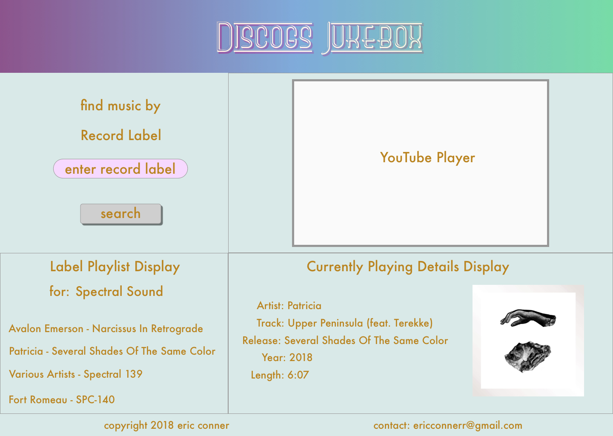

# Discogs Jukebox

#### Epicodus Capstone Project, 2018

#### By Eric Conner

## Description
A music player that uses the Discogs database to discover new music. It will leverage Discogs' API query to create unique playlists. It will then use YouTube to randomly playback the returned songs that are available.

## Goal and Plan of Action

## MVP
* Take user input for a record label
* Query Discogs for songs from the record label
* Query YouTube for available songs from record label
* Randomize YouTube results
* Playback YouTube results in embedded player
* Continue playback until finished with list

## Sketch Framework Image:

## Stretch Goals:
* Refine search filters to include genre, release date range, sold for range, sell for range, sold from range
* Integrate Firebase to store playlists
* Integrate an Add To Cart feature for Discogs store
* Integrate an Add To Wantlist feature for Discogs
* Integrate GoogleMusic if it can fill out gaps in YouTube search results

## Setup/Installation Requirements

* _This is a great place_
* _to list setup instructions_
* _in a simple_
* _easy-to-understand_
* _format_

_{Leave nothing to chance! You want it to be easy for potential users, employers and collaborators to run your app. Do I need to run a server? How should I set up my databases? Is there other code this app depends on?}_

## Known Bugs

_{Are there issues that have not yet been resolved that you want to let users know you know?  Outline any issues that would impact use of your application.  Share any workarounds that are in place. }_

## Support and contact details

Questions, comments or just wanna say hi? Reach out to me any time: ericconnerr@gmail.com

## Technologies Used

React, Atom, github, JS, CSS, Sketch, Discogs API, YouTube API

### License

This software is licensed under the MIT license.

Copyright (c) 2018 **Eric Conner**
